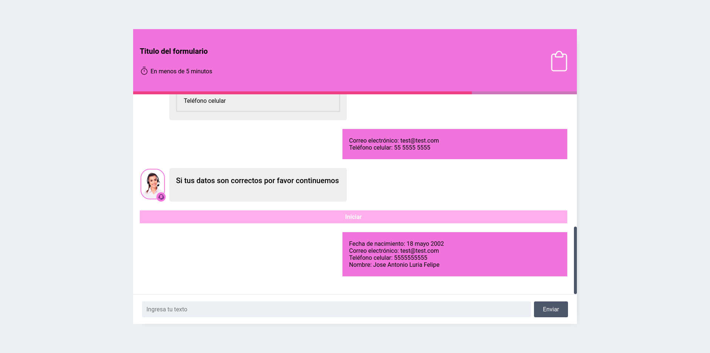

# 🤖 The Rocket Code - Prueba técnica

Aquí se encuentra el reto de [The Rocket Code](https://therocketcode.com/) resuelto, dicho reto consiste en crear una aplicación en React que funciona como un formulario y recaba información del usuario que muestra al final.

[Aquí puedes ver el sitio en vivo](https://bucolic-cobbler-50fdda.netlify.app/)

## 🖼️ Capturas de pantalla



## 🚀 ¿Como usar?

### Primero debes de clonar el repositorio desde GitHub con el siguiente comando:

```shell
git clone https://github.com/JoseLuria/rocket-code-challenge.git
```

### Lo siguiente es moverse a la carpeta del proyecto:

```shell
cd rocket-code-challenge
```

### Después con el siguiente comando instala las dependencias:

```shell
npm install
```

### Por último inicia el repositorio con el siguiente comando:

```shell
npm run dev
```

## 🚨 Validación de datos

La aplicación utiliza una validación por medio de regex para obtener la información de correo electrónico y teléfono del texto.

La información de usuario se guarda en session storage con la clave user

### Los datos deben de cumplir con los siguientes puntos:

- El número de teléfono solo incluye números y su longitud es igual a 10 caracteres.

- El formato del correo electrónico es el correcto.

### El texto donde estará la información del correo electrónico y el número de teléfono debe de tener la siguiente estructura:

```text
Correo electrónico: test@test.com
Teléfono celular: 55 5555 5555
```

### En caso de que la validación no se cumpla, ambos campos se llenaran con el texto de Formato inválido


## ⚙️️ Esta aplicación fue construida usando las siguientes tecnologías

- [React](https://reactjs.org/)
- [Styled Components](https://styled-components.com/)
- [Vite](https://vitejs.dev/)

## 📄 License

[MIT](https://opensource.org/licenses/MIT)
